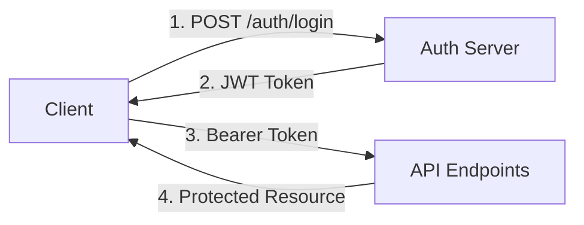

# 🚀 Todo List API

**A production-ready RESTful API for task and list management built with TypeScript, Express.js, and SQLite.**

> **Perfect for AI agents and developers** - This API provides comprehensive task management capabilities with full CRUD operations, advanced filtering, and robust error handling.

[](https://www.typescriptlang.org/)
[](https://expressjs.com/)
[](https://sqlite.org/)
[](#testing)

## 📖 Table of Contents
- [Quick Start](#-quick-start)
- [API Reference](#-api-reference)
- [Authentication](#-authentication)
- [Response Format](#-response-format)
- [Error Handling](#-error-handling)
- [Development Setup](#-development-setup)
- [Testing](#-testing)
- [Architecture](#-architecture)

---

## 🚀 Quick Start

### Base URL
```
http://localhost:3000
```

### Start the API (Development)
```bash
# Clone and setup
git clone <repository-url>
cd todo-list-api
npm install

# Configure environment
cp .env.example .env

# Initialize database
npm run migrate
npm run seed

# Start server
npm run dev
```

### Health Check
```bash
curl http://localhost:3000/health
# Response: {"status": "OK", "timestamp": "2025-07-03T15:30:00.000Z"}
```

---

## 📋 API Reference

### Core Endpoints Overview

| Method | Endpoint | Description | Auth Required |
|--------|----------|-------------|---------------|
| `GET` | `/health` | API health status | ❌ |
| `GET` | `/docs` | Swagger documentation | ❌ |
| `GET` | `/api/lists` | Get all lists | ❌ |
| `POST` | `/api/lists` | Create new list | ❌ |
| `GET` | `/api/lists/:id` | Get specific list | ❌ |
| `PUT` | `/api/lists/:id` | Update list | ❌ |
| `DELETE` | `/api/lists/:id` | Delete list | ❌ |
| `GET` | `/api/tasks` | Get all tasks (with filters) | ❌ |
| `POST` | `/api/lists/:listId/tasks` | Create task in list | ❌ |
| `GET` | `/api/tasks/:id` | Get specific task | ❌ |
| `PUT` | `/api/tasks/:id` | Update task | ❌ |
| `DELETE` | `/api/tasks/:id` | Delete task | ❌ |
| `PATCH` | `/api/tasks/:id/complete` | Toggle task completion | ❌ |

### 📝 Lists API

#### Create List
```http
POST /api/lists
Content-Type: application/json

{
  "name": "Shopping List",
  "description": "Weekly groceries" // optional
}
```

#### Get All Lists
```http
GET /api/lists?withTasks=true  // Optional: include tasks
```

#### Get Specific List
```http
GET /api/lists/uuid-here
```

#### Update List
```http
PUT /api/lists/uuid-here
Content-Type: application/json

{
  "name": "Updated Shopping List",
  "description": "Monthly groceries"
}
```

#### Delete List
```http
DELETE /api/lists/uuid-here
```

### ✅ Tasks API

#### Create Task
```http
POST /api/lists/uuid-here/tasks
Content-Type: application/json

{
  "title": "Buy milk",
  "description": "Get organic milk",           // optional
  "priority": "high",                          // low|medium|high
  "deadline": "2025-07-10T10:00:00.000Z"     // optional ISO date
}
```

#### Get All Tasks (with Advanced Filtering)
```http
GET /api/tasks?completed=false&priority=high&sortBy=deadline&sortOrder=asc
```

**Query Parameters:**
- `completed`: `true|false` - Filter by completion status
- `priority`: `low|medium|high` - Filter by priority level
- `sortBy`: `deadline|createdAt|priority|title` - Sort field
- `sortOrder`: `asc|desc` - Sort direction
- `listId`: `uuid` - Filter by specific list

#### Get Specific Task
```http
GET /api/tasks/uuid-here
```

#### Update Task
```http
PUT /api/tasks/uuid-here
Content-Type: application/json

{
  "title": "Buy organic milk",
  "completed": true,
  "priority": "medium",
  "deadline": "2025-07-11T10:00:00.000Z"
}
```

#### Toggle Task Completion
```http
PATCH /api/tasks/uuid-here/complete
```

#### Delete Task
```http
DELETE /api/tasks/uuid-here
```

### 🔍 Special Endpoints

#### Get Tasks Due This Week
```http
GET /api/tasks/due-this-week
```

#### Get Tasks Sorted by Deadline
```http
GET /api/tasks/sorted-by-deadline?order=asc
```

---

## 🔐 Authentication

**Current Status: No Authentication Required**

This API currently operates without authentication. All endpoints are publicly accessible.

### Future Authentication Flow (Planned)


When authentication is implemented:
1. **Login**: `POST /auth/login` with credentials
2. **Token**: Receive JWT token in response
3. **Headers**: Include `Authorization: Bearer <token>` in requests
4. **Refresh**: Use `POST /auth/refresh` to refresh expired tokens

---

## 📦 Response Format

### Success Response
```json
{
  "success": true,
  "data": {
    "id": "uuid-here",
    "name": "Shopping List",
    "description": "Weekly groceries",
    "createdAt": "2025-07-03T15:30:00.000Z",
    "updatedAt": "2025-07-03T15:30:00.000Z",
    "tasks": []
  },
  "timestamp": "2025-07-03T15:30:00.000Z"
}
```

### Error Response
```json
{
  "success": false,
  "message": "List not found",
  "errorCode": "RESOURCE_NOT_FOUND",
  "details": {
    "resource": "list",
    "id": "invalid-uuid"
  },
  "timestamp": "2025-07-03T15:30:00.000Z"
}
```

### Paginated Response (Future)
```json
{
  "success": true,
  "data": [...],
  "pagination": {
    "page": 1,
    "limit": 20,
    "total": 150,
    "totalPages": 8,
    "hasNext": true,
    "hasPrev": false
  },
  "timestamp": "2025-07-03T15:30:00.000Z"
}
```

---

## ⚠️ Error Handling

### HTTP Status Codes
- `200` - Success
- `201` - Created
- `400` - Bad Request (validation error)
- `404` - Not Found
- `500` - Internal Server Error

### Error Types
```typescript
interface ApiErrorResponse {
  success: false;
  message: string;          // Human-readable error message
  errorCode?: string;       // Machine-readable error code
  details?: any;           // Additional error context
  timestamp: Date;         // Error timestamp
}
```

### Common Error Codes
- `VALIDATION_ERROR` - Request validation failed
- `RESOURCE_NOT_FOUND` - Requested resource doesn't exist
- `DUPLICATE_RESOURCE` - Resource already exists
- `DATABASE_ERROR` - Database operation failed

---

## 🛠️ Development Setup

### Prerequisites
- **Node.js**: v16+ 
- **npm**: v8+
- **TypeScript**: v5.0+

### Environment Variables
```bash
# .env file
NODE_ENV=development
PORT=3000
DATABASE_PATH=./data/todo.db
CORS_ORIGIN=*
LOG_LEVEL=info
REPOSITORY_TYPE=sql  # 'memory' or 'sql'
```

### Available Scripts
```bash
npm run dev          # Start development server with hot reload
npm run build        # Build for production
npm run start        # Start production server
npm run test         # Run test suite (94 tests)
npm run test:watch   # Run tests in watch mode
npm run migrate      # Run database migrations
npm run migrate:down # Rollback migrations
npm run seed         # Seed database with sample data
npm run lint         # Run ESLint
npm run format       # Format code with Prettier
```

### Database Commands
```bash
# Setup database
npm run migrate      # Create tables
npm run seed         # Add sample data

# Reset database
npm run migrate:down # Drop tables
npm run migrate      # Recreate tables
npm run seed         # Re-add sample data
```

---

## 🧪 Testing

### Test Coverage: 94 Tests Passing ✅

```bash
# Run all tests
npm test

# Run with coverage
npm test -- --coverage

# Run specific test suites
npm test tests/unit/repositories
npm test tests/unit/services
```

### Test Categories
- **Repository Layer**: 37 tests (CRUD, validation, edge cases)
- **Service Layer**: 57 tests (business logic, error handling)
- **Integration Tests**: (Coming soon)

### Manual API Testing
```bash
# Test basic functionality
node test-api.js

# Or use the included Postman collection
# Import: docs/Todo-API.postman_collection.json
```

---

## 🏗️ Architecture

### Tech Stack
- **Runtime**: Node.js with TypeScript
- **Framework**: Express.js
- **Database**: SQLite with migrations
- **Testing**: Jest with Supertest
- **Documentation**: Swagger/OpenAPI 3.0
- **Code Quality**: ESLint + Prettier

### Design Patterns
```
📁 src/
├── 🔌 api/               # HTTP layer
│   ├── controllers/      # Request handlers
│   └── routes/          # Route definitions
├── ⚙️ config/           # Configuration
├── 🛡️ middleware/       # Express middleware
├── 📊 models/           # TypeScript interfaces
├── 🗄️ repositories/     # Data access layer
│   ├── interfaces/      # Contracts
│   ├── memory/         # In-memory implementation
│   └── sql/            # SQLite implementation
├── 🧠 services/         # Business logic layer
└── 🔧 utils/           # Utilities and helpers
```

### Key Patterns
- **Repository Pattern**: Data access abstraction
- **Factory Pattern**: Repository instance creation
- **Service Layer**: Business logic separation
- **Dependency Injection**: Loose coupling

### Database Schema
```sql
-- Lists Table
CREATE TABLE lists (
  id VARCHAR PRIMARY KEY,
  name VARCHAR NOT NULL,
  description TEXT,
  created_at TIMESTAMP DEFAULT CURRENT_TIMESTAMP,
  updated_at TIMESTAMP DEFAULT CURRENT_TIMESTAMP
);

-- Tasks Table  
CREATE TABLE tasks (
  id VARCHAR PRIMARY KEY,
  title VARCHAR NOT NULL,
  description TEXT,
  completed BOOLEAN DEFAULT 0,
  deadline TIMESTAMP,
  priority VARCHAR DEFAULT 'medium',
  list_id VARCHAR NOT NULL,
  created_at TIMESTAMP DEFAULT CURRENT_TIMESTAMP,
  updated_at TIMESTAMP DEFAULT CURRENT_TIMESTAMP,
  FOREIGN KEY (list_id) REFERENCES lists(id) ON DELETE CASCADE
);
```

---

## 🤖 AI Integration Examples

### For AI Agents/Assistants

#### Create a structured daily plan
```javascript
// Create a "Daily Tasks" list
const listResponse = await fetch('http://localhost:3000/api/lists', {
  method: 'POST',
  headers: { 'Content-Type': 'application/json' },
  body: JSON.stringify({
    name: 'Daily Tasks',
    description: 'AI-generated daily plan'
  })
});
const { data: list } = await listResponse.json();

// Add prioritized tasks
const tasks = [
  { title: 'Review emails', priority: 'high', deadline: '2025-07-03T09:00:00Z' },
  { title: 'Team meeting', priority: 'high', deadline: '2025-07-03T14:00:00Z' },
  { title: 'Code review', priority: 'medium', deadline: '2025-07-03T16:00:00Z' }
];

for (const task of tasks) {
  await fetch(`http://localhost:3000/api/lists/${list.id}/tasks`, {
    method: 'POST',
    headers: { 'Content-Type': 'application/json' },
    body: JSON.stringify(task)
  });
}
```

#### Intelligent task filtering
```javascript
// Get overdue high-priority tasks
const now = new Date().toISOString();
const response = await fetch(
  `http://localhost:3000/api/tasks?completed=false&priority=high&sortBy=deadline&sortOrder=asc`
);
const { data: tasks } = await response.json();

// Filter overdue tasks programmatically
const overdueTasks = tasks.filter(task => 
  task.deadline && new Date(task.deadline) < new Date()
);
```

#### Smart task completion workflow
```javascript
// AI workflow: Mark related tasks as complete
async function completeProjectTasks(projectKeyword) {
  // Get all incomplete tasks
  const response = await fetch('http://localhost:3000/api/tasks?completed=false');
  const { data: tasks } = await response.json();
  
  // Find related tasks by keyword matching
  const relatedTasks = tasks.filter(task => 
    task.title.toLowerCase().includes(projectKeyword.toLowerCase()) ||
    task.description?.toLowerCase().includes(projectKeyword.toLowerCase())
  );
  
  // Complete all related tasks
  for (const task of relatedTasks) {
    await fetch(`http://localhost:3000/api/tasks/${task.id}/complete`, {
      method: 'PATCH'
    });
  }
  
  return relatedTasks.length;
}
```

#### Priority-based task management
```javascript
// AI algorithm: Auto-prioritize tasks based on deadline proximity
async function autoPrioritizeTasks() {
  const response = await fetch('http://localhost:3000/api/tasks?completed=false');
  const { data: tasks } = await response.json();
  
  const now = new Date();
  
  for (const task of tasks) {
    if (!task.deadline) continue;
    
    const deadline = new Date(task.deadline);
    const daysUntilDeadline = (deadline - now) / (1000 * 60 * 60 * 24);
    
    let newPriority = 'low';
    if (daysUntilDeadline <= 1) newPriority = 'high';
    else if (daysUntilDeadline <= 3) newPriority = 'medium';
    
    if (task.priority !== newPriority) {
      await fetch(`http://localhost:3000/api/tasks/${task.id}`, {
        method: 'PUT',
        headers: { 'Content-Type': 'application/json' },
        body: JSON.stringify({ ...task, priority: newPriority })
      });
    }
  }
}
```

### Machine-Readable API Schema

#### TypeScript Interfaces for AI Development
```typescript
interface List {
  id: string;                    // UUID v4 format
  name: string;                  // Max 255 characters
  description?: string;          // Optional, max 1000 characters
  createdAt: string;            // ISO 8601 date string
  updatedAt: string;            // ISO 8601 date string
  tasks?: Task[];               // Optional array when withTasks=true
}

interface Task {
  id: string;                    // UUID v4 format
  title: string;                 // Max 255 characters, required
  description?: string;          // Optional, max 1000 characters
  completed: boolean;            // Default: false
  deadline?: string;             // Optional ISO 8601 date string
  priority: 'low' | 'medium' | 'high';  // Default: 'medium'
  listId: string;               // Foreign key to List
  createdAt: string;            // ISO 8601 date string
  updatedAt: string;            // ISO 8601 date string
}

interface ApiResponse<T> {
  success: boolean;
  data?: T;
  message?: string;             // Present on error
  errorCode?: string;           // Machine-readable error identifier
  details?: any;                // Additional error context
  timestamp: string;            // ISO 8601 date string
}
```

#### API Constraints for AI Validation
```javascript
const API_CONSTRAINTS = {
  list: {
    name: { required: true, maxLength: 255, minLength: 1 },
    description: { required: false, maxLength: 1000 }
  },
  task: {
    title: { required: true, maxLength: 255, minLength: 1 },
    description: { required: false, maxLength: 1000 },
    priority: { enum: ['low', 'medium', 'high'], default: 'medium' },
    deadline: { format: 'ISO8601', futureDate: true }
  },
  query: {
    sortBy: { enum: ['deadline', 'createdAt', 'priority', 'title'] },
    sortOrder: { enum: ['asc', 'desc'] },
    priority: { enum: ['low', 'medium', 'high'] },
    completed: { enum: ['true', 'false'] }
  }
};
```

### Performance Considerations for AI

#### Rate Limiting (Future Implementation)
- **Endpoint Limits**: 100 requests/minute per IP
- **Bulk Operations**: Consider batching task creation
- **Real-time Updates**: Use polling with 5-second intervals minimum

#### Response Time Expectations
- **Simple GET requests**: < 50ms
- **Complex filtered queries**: < 200ms
- **CRUD operations**: < 100ms
- **Bulk operations**: < 500ms per 100 items

#### Optimal AI Usage Patterns
```javascript
// GOOD: Batch operations
const tasks = await Promise.all([
  createTask(list1Id, task1Data),
  createTask(list1Id, task2Data),
  createTask(list1Id, task3Data)
]);

// BETTER: Use filtering instead of fetching all
const urgentTasks = await fetch('/api/tasks?priority=high&completed=false');

// BEST: Use specific endpoints when available
const dueTasks = await fetch('/api/tasks/due-this-week');
```

---

## 🤖 AI Developer Guide

### Common AI Patterns & Use Cases

#### 1. **Task Automation Workflows**
```javascript
// Pattern: AI agent manages user's daily workflow
class TodoAIAgent {
  constructor(baseUrl = 'http://localhost:3000') {
    this.baseUrl = baseUrl;
  }

  async createDailyWorkflow(date, meetings, priorities) {
    // Create date-specific list
    const list = await this.createList(`Tasks for ${date}`, `AI-generated daily plan`);
    
    // Add calendar-based tasks
    for (const meeting of meetings) {
      await this.createTask(list.id, {
        title: `Prepare for ${meeting.title}`,
        priority: 'high',
        deadline: new Date(meeting.start - 30 * 60 * 1000).toISOString()
      });
    }
    
    // Add priority tasks
    for (const task of priorities) {
      await this.createTask(list.id, task);
    }
    
    return list;
  }

  async getSmartRecommendations() {
    // Get all incomplete tasks
    const response = await fetch(`${this.baseUrl}/api/tasks?completed=false`);
    const { data: tasks } = await response.json();
    
    const now = new Date();
    
    return {
      overdue: tasks.filter(t => t.deadline && new Date(t.deadline) < now),
      urgent: tasks.filter(t => t.priority === 'high' && !t.completed),
      upcoming: tasks.filter(t => {
        if (!t.deadline) return false;
        const deadline = new Date(t.deadline);
        const hoursUntil = (deadline - now) / (1000 * 60 * 60);
        return hoursUntil > 0 && hoursUntil <= 24;
      })
    };
  }
}
```

#### 2. **Natural Language Processing Integration**
```javascript
// Pattern: Convert natural language to structured tasks
async function parseNaturalLanguageTask(nlText) {
  // Example: "Finish the report by Friday at high priority"
  const patterns = {
    deadline: /by\s+(monday|tuesday|wednesday|thursday|friday|saturday|sunday)/i,
    priority: /(low|medium|high)\s+priority/i,
    title: /^([^,]+)/
  };
  
  const title = nlText.match(patterns.title)?.[1]?.trim() || nlText;
  const priority = nlText.match(patterns.priority)?.[1]?.toLowerCase() || 'medium';
  
  // Convert day name to date
  let deadline = null;
  const dayMatch = nlText.match(patterns.deadline);
  if (dayMatch) {
    const targetDay = dayMatch[1].toLowerCase();
    deadline = getNextWeekday(targetDay).toISOString();
  }
  
  return { title, priority, deadline };
}

// Usage with API
async function addNaturalLanguageTask(listId, nlText) {
  const taskData = await parseNaturalLanguageTask(nlText);
  
  const response = await fetch(`http://localhost:3000/api/lists/${listId}/tasks`, {
    method: 'POST',
    headers: { 'Content-Type': 'application/json' },
    body: JSON.stringify(taskData)
  });
  
  return response.json();
}
```

#### 3. **Smart Analytics & Insights**
```javascript
// Pattern: AI analytics for productivity insights
class TaskAnalytics {
  constructor(baseUrl = 'http://localhost:3000') {
    this.baseUrl = baseUrl;
  }

  async getProductivityInsights() {
    const [tasks, lists] = await Promise.all([
      fetch(`${this.baseUrl}/api/tasks`).then(r => r.json()),
      fetch(`${this.baseUrl}/api/lists`).then(r => r.json())
    ]);
    
    const allTasks = tasks.data;
    const completedTasks = allTasks.filter(t => t.completed);
    
    return {
      totalTasks: allTasks.length,
      completedTasks: completedTasks.length,
      completionRate: completedTasks.length / allTasks.length,
      averageTasksPerList: allTasks.length / lists.data.length,
      priorityDistribution: {
        high: allTasks.filter(t => t.priority === 'high').length,
        medium: allTasks.filter(t => t.priority === 'medium').length,
        low: allTasks.filter(t => t.priority === 'low').length
      },
      overdueCount: allTasks.filter(t => 
        t.deadline && new Date(t.deadline) < new Date() && !t.completed
      ).length
    };
  }

  async suggestOptimizations() {
    const insights = await this.getProductivityInsights();
    const suggestions = [];
    
    if (insights.completionRate < 0.7) {
      suggestions.push("Consider breaking down large tasks into smaller ones");
    }
    
    if (insights.overdueCount > 5) {
      suggestions.push("Review deadlines and prioritize overdue tasks");
    }
    
    if (insights.priorityDistribution.high > insights.priorityDistribution.medium) {
      suggestions.push("Balance task priorities to avoid overwhelm");
    }
    
    return suggestions;
  }
}
```

### API Client Libraries for AI

#### Python Client Example
```python
import requests
from datetime import datetime, timedelta
from typing import List, Dict, Optional

class TodoAPIClient:
    def __init__(self, base_url: str = "http://localhost:3000"):
        self.base_url = base_url
        self.session = requests.Session()
        self.session.headers.update({"Content-Type": "application/json"})
    
    def create_list(self, name: str, description: str = None) -> Dict:
        """Create a new todo list"""
        payload = {"name": name}
        if description:
            payload["description"] = description
            
        response = self.session.post(f"{self.base_url}/api/lists", json=payload)
        return response.json()
    
    def create_task(self, list_id: str, title: str, **kwargs) -> Dict:
        """Create a new task in a list"""
        payload = {"title": title, **kwargs}
        response = self.session.post(
            f"{self.base_url}/api/lists/{list_id}/tasks", 
            json=payload
        )
        return response.json()
    
    def get_tasks_by_priority(self, priority: str, completed: bool = False) -> List[Dict]:
        """Get tasks filtered by priority and completion status"""
        params = {"priority": priority, "completed": str(completed).lower()}
        response = self.session.get(f"{self.base_url}/api/tasks", params=params)
        return response.json().get("data", [])
    
    def auto_prioritize_by_deadline(self) -> int:
        """AI function to auto-prioritize tasks based on deadlines"""
        tasks = self.get_tasks_by_priority("low") + self.get_tasks_by_priority("medium")
        updated_count = 0
        
        for task in tasks:
            if not task.get("deadline") or task.get("completed"):
                continue
                
            deadline = datetime.fromisoformat(task["deadline"].replace('Z', '+00:00'))
            days_until = (deadline - datetime.now()).days
            
            new_priority = task["priority"]
            if days_until <= 1:
                new_priority = "high"
            elif days_until <= 3:
                new_priority = "medium"
            
            if new_priority != task["priority"]:
                task["priority"] = new_priority
                self.session.put(f"{self.base_url}/api/tasks/{task['id']}", json=task)
                updated_count += 1
        
        return updated_count

# Usage example
client = TodoAPIClient()
work_list = client.create_list("AI Work Tasks", "Tasks managed by AI assistant")
client.create_task(
    work_list["data"]["id"], 
    "Review ML model performance",
    priority="high",
    deadline=(datetime.now() + timedelta(days=2)).isoformat()
)
```

### Error Handling for AI Systems

#### Robust Error Handling Pattern
```javascript
class RobustTodoClient {
  constructor(baseUrl, options = {}) {
    this.baseUrl = baseUrl;
    this.retryAttempts = options.retryAttempts || 3;
    this.retryDelay = options.retryDelay || 1000;
  }

  async apiCall(endpoint, options = {}) {
    const url = `${this.baseUrl}${endpoint}`;
    let lastError;

    for (let attempt = 1; attempt <= this.retryAttempts; attempt++) {
      try {
        const response = await fetch(url, {
          headers: { 'Content-Type': 'application/json' },
          ...options
        });

        if (!response.ok) {
          const errorData = await response.json();
          throw new APIError(errorData.message, response.status, errorData.errorCode);
        }

        return await response.json();
      } catch (error) {
        lastError = error;
        
        if (attempt < this.retryAttempts && this.isRetryableError(error)) {
          await this.delay(this.retryDelay * attempt);
          continue;
        }
        
        break;
      }
    }

    throw lastError;
  }

  isRetryableError(error) {
    // Retry on network errors and 5xx server errors
    return !error.status || error.status >= 500;
  }

  delay(ms) {
    return new Promise(resolve => setTimeout(resolve, ms));
  }
}

class APIError extends Error {
  constructor(message, status, code) {
    super(message);
    this.name = 'APIError';
    this.status = status;
    this.code = code;
  }
}
```

### AI Testing Patterns

#### Automated API Testing for AI
```javascript
// Test suite for AI integration
const testScenarios = [
  {
    name: "AI Daily Workflow Creation",
    async test(client) {
      const list = await client.createList("AI Test List");
      const tasks = await Promise.all([
        client.createTask(list.data.id, { title: "Morning standup", priority: "high" }),
        client.createTask(list.data.id, { title: "Code review", priority: "medium" }),
        client.createTask(list.data.id, { title: "Documentation", priority: "low" })
      ]);
      
      assert(tasks.length === 3);
      assert(tasks.every(t => t.success));
    }
  },
  {
    name: "Smart Task Filtering",
    async test(client) {
      const highPriorityTasks = await client.getTasks({ priority: "high", completed: false });
      assert(Array.isArray(highPriorityTasks.data));
      assert(highPriorityTasks.data.every(t => t.priority === "high" && !t.completed));
    }
  }
];

// Run AI integration tests
async function runAITests() {
  const client = new RobustTodoClient("http://localhost:3000");
  
  for (const scenario of testScenarios) {
    try {
      await scenario.test(client);
      console.log(`✅ ${scenario.name}`);
    } catch (error) {
      console.error(`❌ ${scenario.name}: ${error.message}`);
    }
  }
}
```

---

## 📚 Additional Resources

- **API Documentation**: [http://localhost:3000/docs](http://localhost:3000/docs) (Swagger UI)
- **OpenAPI Spec**: Available at `/docs/openapi.json`
- **Postman Collection**: `docs/Todo-API.postman_collection.json`
- **Database Migrations**: `src/migrations/`
- **Test Examples**: `tests/` directory

---

## 🤝 Contributing

1. **Fork** the repository
2. **Create** a feature branch: `git checkout -b feature-name`
3. **Commit** changes: `git commit -am 'Add feature'`
4. **Push** to branch: `git push origin feature-name`
5. **Submit** a pull request

### Development Guidelines
- Follow TypeScript best practices
- Add tests for new features
- Update documentation
- Run `npm run lint` before committing

---

## 📄 License

MIT License - see [LICENSE](LICENSE) file for details.

---

**🎯 Ready to integrate? Start with a simple `GET /health` request to verify the API is running!**

1. **Clone the repository**
   ```bash
   git clone <repository-url>
   cd todo-list-api
   ```

2. **Install dependencies**
   ```bash
   npm install
   ```

3. **Set up environment variables**
   ```bash
   cp .env.example .env
   ```

4. **Run database migrations**
   ```bash
   npm run migrate
   ```

5. **Seed the database (optional)**
   ```bash
   npm run seed
   ```

6. **Start the development server**
   ```bash
   npx ts-node src/app.ts
   ```

The API will be available at `http://localhost:3000`

## 📝 Usage Examples

### Create a List
```bash
curl -X POST http://localhost:3000/api/lists \
  -H "Content-Type: application/json" \
  -d '{"name": "Shopping List", "description": "Grocery items"}'
```

### Create a Task
```bash
curl -X POST http://localhost:3000/api/lists/{listId}/tasks \
  -H "Content-Type: application/json" \
  -d '{"title": "Buy milk", "priority": "high", "deadline": "2025-07-05T10:00:00Z"}'
```

### Get Tasks Due This Week
```bash
curl http://localhost:3000/api/tasks/due-this-week
```

### Filter Completed Tasks
```bash
curl "http://localhost:3000/api/tasks?completed=true&sortBy=deadline&sortOrder=asc"
```

## 🏗️ Architecture

### Project Structure
```
src/
├── api/
│   ├── controllers/     # Request handlers
│   └── routes/         # Route definitions
├── config/
│   ├── database.ts     # Database configuration
│   └── environment.ts  # Environment settings
├── middleware/         # Express middleware
├── migrations/         # Database migrations
├── models/            # TypeScript interfaces
├── repositories/      # Data access layer
│   ├── interfaces/    # Repository contracts
│   ├── memory/       # In-memory implementations
│   └── sql/          # SQL implementations
├── services/         # Business logic layer
└── utils/           # Utility functions
```

### Design Patterns
- **Repository Pattern**: Abstracts data access logic
- **Factory Pattern**: Creates repository instances
- **Service Layer**: Contains business logic
- **Dependency Injection**: Loose coupling between layers

## 🗄️ Database

### SQLite Schema

**Lists Table**
- `id` (VARCHAR) - Primary key
- `name` (VARCHAR) - List name
- `description` (TEXT) - Optional description
- `created_at` (TIMESTAMP) - Creation timestamp
- `updated_at` (TIMESTAMP) - Last update timestamp

**Tasks Table**
- `id` (VARCHAR) - Primary key
- `title` (VARCHAR) - Task title
- `description` (TEXT) - Optional description
- `completed` (BOOLEAN) - Completion status
- `deadline` (TIMESTAMP) - Optional deadline
- `priority` (VARCHAR) - Priority level (low/medium/high)
- `list_id` (VARCHAR) - Foreign key to lists table
- `created_at` (TIMESTAMP) - Creation timestamp
- `updated_at` (TIMESTAMP) - Last update timestamp

### Migration Commands
```bash
npm run migrate        # Run all pending migrations
npm run migrate:up     # Run migrations up
npm run migrate:down   # Rollback last migration
npm run seed          # Seed database with sample data
```

## 🧪 Testing

Run the included test script:
```bash
node test-api.js
```

This tests all major API endpoints and verifies functionality.

## 📋 Development Tasks Status

### ✅ Completed Tasks

#### Task 1: Project Setup ✅
- [x] Initialize npm project with TypeScript configuration
- [x] Setup Vite build configuration for Node.js backend
- [x] Install and configure Express.js with TypeScript
- [x] Setup ESLint and Prettier for code quality
- [x] Configure tsconfig.json for proper TypeScript compilation
- [x] Setup project folder structure
- [x] Create environment configuration
- [x] Setup package.json scripts

#### Task 2: Database Setup and Migration System ✅
- [x] Choose and setup SQL database (SQLite)
- [x] Create database connection configuration
- [x] Implement migration system for database schema changes
- [x] Create initial migration for Lists table
- [x] Create initial migration for Tasks table
- [x] Setup database seeding for development data
- [x] Create migration runner script
- [x] Test migration up/down functionality

#### Task 3: Memory Repository Implementation ✅
- [x] Create IListRepository interface
- [x] Create ITaskRepository interface
- [x] Implement MemoryListRepository class
- [x] Implement MemoryTaskRepository class
- [x] Add CRUD operations for Lists in memory
- [x] Add CRUD operations for Tasks in memory
- [x] Implement task filtering by deadline
- [x] Implement task sorting by deadline
- [x] Add data validation in repository layer

#### Task 4: SQL Database Repository Implementation ✅
- [x] Implement SQLListRepository class
- [x] Implement SQLTaskRepository class
- [x] Create database query methods for Lists CRUD
- [x] Create database query methods for Tasks CRUD
- [x] Implement complex queries (due this week, sorting by deadline)
- [x] Add proper error handling for database operations

#### Task 5: List Service Implementation ✅
- [x] Create ListService class with business logic
- [x] Implement createList method with validation
- [x] Implement updateList method with validation
- [x] Implement deleteList method with cascade handling
- [x] Implement getAllLists method with task population
- [x] Implement getListById method
- [x] Add input validation and sanitization
- [x] Add business rule validation
- [x] Handle error scenarios gracefully

#### Task 6: Task Service Implementation ✅
- [x] Create TaskService class with business logic
- [x] Implement createTask method with validation
- [x] Implement updateTask method with validation
- [x] Implement deleteTask method
- [x] Implement toggleTaskCompletion method
- [x] Implement getTasksDueThisWeek method
- [x] Implement getTasksSortedByDeadline method
- [x] Add deadline validation and date handling
- [x] Add priority level validation

#### Task 7: Express.js Server Setup and Middleware ✅
- [x] Setup Express.js server with TypeScript
- [x] Configure CORS middleware
- [x] Setup JSON body parser middleware
- [x] Add request logging middleware
- [x] Setup error handling middleware
- [x] Configure environment-based settings
- [x] Add health check endpoint
- [x] Setup graceful shutdown handling

#### Task 8: List API Endpoints Implementation ✅
- [x] Create ListController class
- [x] Implement GET /api/lists endpoint with TSDoc
- [x] Implement POST /api/lists endpoint with TSDoc
- [x] Implement PUT /api/lists/:id endpoint with TSDoc
- [x] Implement DELETE /api/lists/:id endpoint with TSDoc
- [x] Add request validation for all endpoints
- [x] Add proper HTTP status codes
- [x] Add error response formatting
- [x] Test all list endpoints manually

#### Task 9: Task API Endpoints Implementation ✅
- [x] Create TaskController class
- [x] Implement POST /api/lists/:listId/tasks endpoint with TSDoc
- [x] Implement PUT /api/tasks/:id endpoint with TSDoc
- [x] Implement DELETE /api/tasks/:id endpoint with TSDoc
- [x] Implement PATCH /api/tasks/:id/complete endpoint with TSDoc
- [x] Implement GET /api/tasks/due-this-week endpoint with TSDoc
- [x] Implement GET /api/tasks?sort=deadline endpoint with TSDoc
- [x] Add query parameter validation
- [x] Add date handling for deadline queries
- [x] Test all task endpoints manually

#### Task 13: Repository Pattern Configuration System ✅
- [x] Create RepositoryFactory pattern
- [x] Implement dependency injection for repositories
- [x] Add environment-based repository selection
- [x] Create configuration for switching between memory/SQL repos
- [x] Test repository switching functionality
- [x] Update service layer to use factory pattern

## 🎯 **MILESTONE 1: CORE API COMPLETED** ✅

The Todo List API is now fully functional with:
- ✅ Working database with migrations and seeding
- ✅ Complete CRUD operations for lists and tasks
- ✅ Advanced filtering and sorting capabilities
- ✅ Proper error handling and validation
- ✅ Repository pattern with SQL and memory implementations
- ✅ RESTful API design with comprehensive endpoints
- ✅ TypeScript type safety throughout
- ✅ Tested and verified functionality

### Next Steps (Future Enhancements)
- [ ] OpenAPI/Swagger documentation
- [ ] Comprehensive testing suite with Jest
- [ ] Authentication and authorization
- [ ] Pagination for large datasets
- [ ] Docker containerization
- [ ] Performance optimization and monitoring

## 🤝 Contributing

1. Fork the repository
2. Create a feature branch
3. Make your changes
4. Add tests
5. Submit a pull request

## 📄 License

MIT License - see LICENSE file for details
